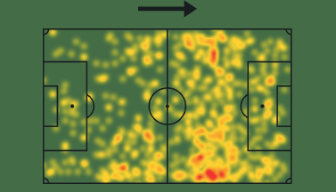
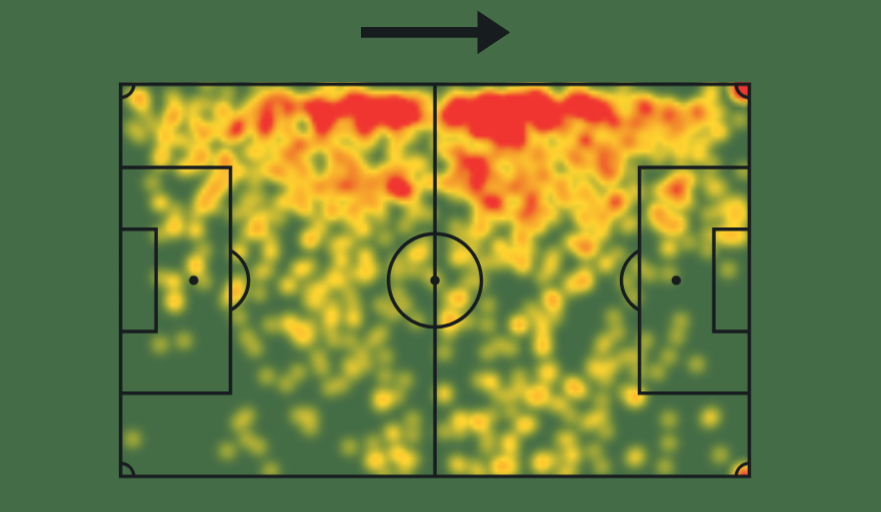
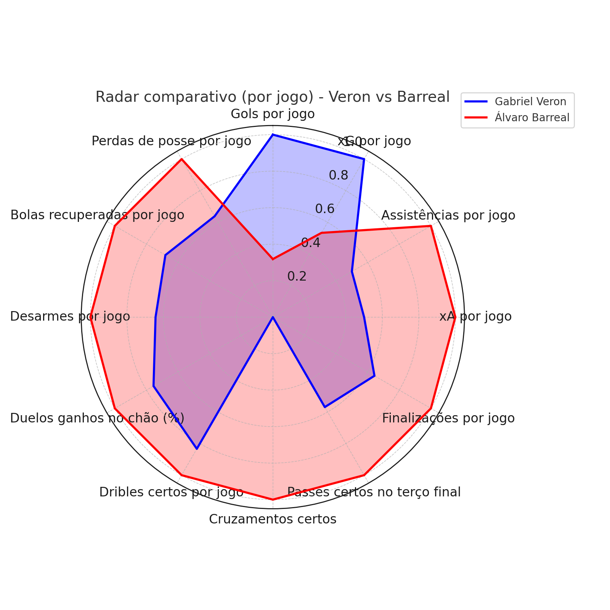

## 📊 Análise de Desempenho: Gabriel Veron (2024) + Comparativo com Álvaro Barreal

Este repositório apresenta uma análise estatística individual de **Gabriel Veron** na temporada 2024 do Campeonato Brasileiro, bem como um **comparativo com Álvaro Barreal**, ambos jogadores do Cruzeiro durante o período.

O objetivo é aplicar conceitos de **análise de desempenho no futebol** com base em dados quantitativos, utilizando ferramentas de visualização (radar e mapa de calor), e interpretar os números à luz do desempenho técnico-tático.

> **Nota**: Todos os dados foram extraídos das plataformas [Sofascore](https://www.sofascore.com/) e [Flashscore](https://www.flashscore.com/) e representam **médias por jogo**, garantindo comparabilidade justa.

---

### 📌 Estrutura do Repositório

```bash
├── README.md                  # Introdução ao projeto
├── analise_veron_barreal.md  # Análise completa com texto interpretativo
├── assets/
│   ├── veron_heatmap.png
│   ├── barreal_heatmap.png
│   ├── veron_vs_barreal_radar.png
│   └── veron_vs_barreal_2024.xlsx
```

---

### 📷 Destaques Visuais

#### 🔥 Mapas de Calor

Gabriel Veron | Álvaro Barreal
:--:|:--:
 | 

#### 📈 Radar Comparativo



---

### 📄 Dados Utilizados

Arquivo disponível em `/assets/veron_vs_barreal_2024.xlsx` contendo as seguintes métricas:
- Gols e assistências
- xG e xA por jogo
- Finalizações, dribles e passes certos
- Participações defensivas (desarmes, bolas recuperadas)
- Duelos e perdas de posse
