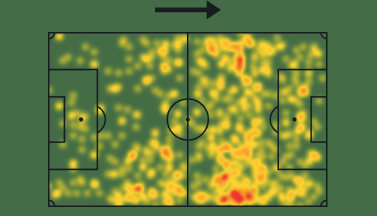

# Análise Individual: Gabriel Veron – Campeonato Brasileiro 2024

## 1. Introdução

Gabriel Veron chegou ao Cruzeiro em 2024 com expectativas de retomar o protagonismo que o revelou no Palmeiras. Atuando majoritariamente como ponta direita, ele se consolidou como uma peça ofensiva de infiltração, mais voltada para a finalização do que para a construção de jogadas. Esta análise busca entender, a partir dos dados de desempenho e mapas de calor, como Veron contribuiu para o time durante a temporada do Campeonato Brasileiro.

---

## 2. Desempenho Individual

- **Minutos por jogo:** 60
- **Gols por jogo:** 0.22
- **xG por jogo:** 0.15
- **Assistências por jogo:** 0.07
- **xA por jogo:** 0.04
- **Finalizações por jogo:** 0.9
- **Passes certos por jogo:** 10.6 (77%)
- **Dribles certos por jogo:** 0.5 (40%)
- **Desarmes por jogo:** 0.9

Veron se destaca pela eficiência como finalizador, com uma taxa de conversão de 25%, superior ao seu xG (indicando que marca mais do que o esperado pelas chances que tem). Apesar de finalizar pouco, aproveita bem as oportunidades. Por outro lado, sua participação criativa é discreta, com poucos passes importantes (0.8 por jogo) e nenhuma grande chance criada.

No aspecto defensivo, colabora com desarmes e interceptações modestas, mas mantém boa consistência com a posse: não comete erros que resultem em finalizações adversárias.

---

## 3. Perfil Tático e Mapa de Calor

O mapa de calor de Veron mostra um jogador ativo pelo corredor direito, com incursões pontuais pela faixa central e entradas na área. Seu comportamento tático condiz com o papel de um ponta agressivo, que busca diagonais curtas e penetrações sem bola para finalizar.

Essa ocupação de espaços reforça a análise quantitativa: Veron atua mais como finalizador do que como construtor, sendo menos acionado na base da jogada e mais presente na última fase do ataque.

---

## 4. Comparativo com Álvaro Barreal

Enquanto Veron aparece como um finalizador eficiente, Álvaro Barreal se destaca pelo volume de participação e capacidade criativa. Com mais assistências (0.14 por jogo), maior xA (0.08), e praticamente o dobro de passes certos (21.7), Barreal tem função mais construtora na equipe.

| Métrica                    | Veron | Barreal |
| -------------------------- | ----- | ------- |
| Gols por jogo              | 0.22  | 0.07    |
| xG por jogo                | 0.15  | 0.08    |
| Assistências por jogo      | 0.07  | 0.14    |
| xA por jogo                | 0.04  | 0.08    |
| Finalizações por jogo      | 0.9   | 1.4     |
| Passes certos por jogo     | 10.6  | 21.7    |
| Passes no terço final      | 7.4   | 13.0    |
| Dribles certos por jogo    | 0.5   | 0.6     |
| Duelos ganhos por jogo     | 2.0   | 2.9     |
| Bolas recuperadas por jogo | 1.7   | 2.5     |

Mapa de calor de Barreal:

Barreal é mais ativo pela esquerda, com forte presença na intermediária ofensiva e maior envolvimento nas fases iniciais das jogadas. Atua como "meia externo", auxiliando na construção e distribuindo a posse.

---

## 5. Radar Comparativo

O radar abaixo resume a diferença de perfil entre os dois atletas. Veron se destaca nas finalizações e conversão, enquanto Barreal supera em passes, assistências, duelos e bolas recuperadas.

Essa diferença visual mostra como os dois podem ser complementares em campo, com funções bem definidas: um com mais agressividade e eficiência, o outro com mais participação e volume.

---

## 6. Conclusão

Gabriel Veron é um ponta de infiltração, que traz poder de fogo mesmo com baixa participação na construção. Sua eficiência nas finalizações e movimentação na área são diferenciais claros, mas sua evolução passa por maior participação criativa e aumento na taxa de acerto nos dribles.

Em contrapartida, Barreal se mostra um jogador mais completo em termos de participação no jogo, com impacto maior em assistências, construção e recuperações.

Essa análise reforça como diferentes perfis técnico-táticos podem coexistir em um mesmo sistema de jogo, trazendo equilíbrio entre criação e definição.

<!-- Adicione aqui a análise completa com texto interpretativo -->
